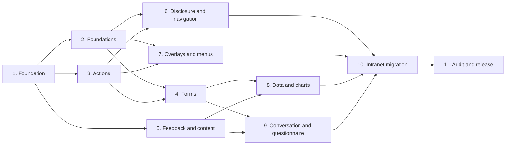

# Shadcn Blazor Implementation Roadmap

> **For agentic workers:** REQUIRED SUB-SKILL: Use superpowers:subagent-driven-development (recommended) or superpowers:executing-plans to implement each linked plan task-by-task. Steps use checkbox (`- [ ]`) syntax for tracking.

**Goal:** Deliver the reusable 64-component `Maliev.ShadcnBlazor` library, prove Shadcn Base/Vega/Neutral visual and behavioral conformance, and migrate all 41 MudBlazor types used by `Legacy.Maliev.Intranet` without changing application contracts.

**Architecture:** A MudBlazor-backed Razor Class Library owns stable Shadcn-prefixed Blazor APIs, semantic tokens, component composition, and package assets. A deterministic Blazor showcase, pinned upstream reference host, component tests, and Playwright comparisons provide evidence; Intranet adopts the package only after the component families are independently complete.

**Tech Stack:** .NET 10, Blazor Razor Class Library, MudBlazor 9.7.0, bUnit 2.9.0, xUnit 2.9.3, Microsoft.Playwright.Xunit 1.61.0, pnpm 10.33.4, React 19.2.3 reference fixtures, Shadcn Base UI at commit `6261bd89f72d794aea491482cc2acfd8dc3d63e2`.

## Global Constraints

- Use Shadcn repository commit `6261bd89f72d794aea491482cc2acfd8dc3d63e2`, Base registry `apps/v4/registry/bases/base/ui`, and Vega style `apps/v4/registry/styles/style-vega.css` as the immutable initial reference.
- Implement the Neutral semantic palette and upstream `0.625rem` radius scale; component code consumes semantic variables instead of raw presentation colors.
- Keep MudBlazor at 9.7.0 until a separately validated dependency-upgrade slice is approved.
- Target `net10.0`, enable nullable reference types and implicit usings, and treat warnings as errors.
- Public package code must not reference `Legacy.Maliev.Intranet.*`, Intranet routes, DTOs, services, authentication, or business resources.
- Existing Intranet binding, validation, focus, keyboard, provider, callback, localization, THB, Asia/Bangkok display, and UTC storage contracts must remain unchanged.
- Library-owned component icons use the pinned upstream Lucide shapes; consumer content uses `RenderFragment` icon slots.
- Component fixtures cover applicable default, hover, active, focus, disabled, read-only, invalid, loading, selected, open, responsive, light/dark, RTL, reduced-motion, forced-colors, keyboard, pointer, and touch states.
- Build affected projects first with zero warnings and errors, then run focused tests, the affected suite, static/accessibility checks, and browser/visual checks.
- Each implementation plan is independently reviewable and committed. Do not combine plans or push commits without explicit authorization.
- The separate non-Mud compatibility Razor host is excluded.

---

## Plan topology

Plans 2, 3, and 5 may run concurrently after Plan 1. Plans 6 and 7 may run concurrently after their dependencies. Plans 8 and 9 may run concurrently after their dependencies. Plans 10 and 11 remain sequential integration gates.

## Plan inventory and exit gates

### Plan 1: Package and validation foundation

**Detailed plan:** `docs/superpowers/plans/2026-08-10-shadcn-blazor-foundation-plan.md`

**Owns:** Reference manifest and ledger, RCL and test projects, semantic tokens, theme factory, service registration, scoped provider, showcase shell, Playwright infrastructure, package metadata, licenses, and validation scripts.

**Exit gate:** A consumer can register the package, render `ShadcnThemeProvider`, load the pinned token sheet, open the showcase foundation fixture, and pass library/component/browser smoke tests with a verified upstream manifest.

### Plan 2: Semantic foundations

**Plan file to create before execution:** `docs/superpowers/plans/2026-08-10-shadcn-blazor-semantic-foundations-plan.md`

**Components:** Direction, Aspect Ratio, Typography, Label, Field, Item, Kbd, Separator, Empty.

**Owns:** The pinned React reference-host activation and pnpm lockfile, the first side-by-side reference fixture, semantic markup primitives, direction context, field composition and ARIA relationships, prose/typeset system, generic item and empty-state structures.

**Exit gate:** The reference and Blazor hosts run at pinned versions and can be compared by one browser test; nine ledger entries are complete with API, component, accessibility, computed-style, interaction, and visual evidence.

### Plan 3: Actions and selection

**Plan file to create before execution:** `docs/superpowers/plans/2026-08-10-shadcn-blazor-actions-plan.md`

**Components:** Button, Button Group, Toggle, Toggle Group, Checkbox, Radio Group, Switch, Slider.

**Owns:** Variants, sizes, icon slots, pressed/checked/value binding, roving focus, keyboard behavior, disabled and invalid states.

**Exit gate:** Eight ledger entries are complete and every action suppresses callbacks while disabled without changing two-way binding semantics.

### Plan 4: Forms and date selection

**Plan file to create before execution:** `docs/superpowers/plans/2026-08-10-shadcn-blazor-forms-plan.md`

**Components:** Input, Textarea, Input Group, Input OTP, Native Select, Select, Combobox, Calendar, Date Picker.

**Owns:** `EditForm` integration, typed values, validation expressions, grouped controls, selection/typeahead, OTP keyboard/paste, calendar selection, and timezone-safe date-only behavior.

**Exit gate:** Nine ledger entries are complete; required, read-only, disabled, invalid, clearable, open, selected, and mobile keyboard states have browser proof.

### Plan 5: Feedback and content

**Plan file to create before execution:** `docs/superpowers/plans/2026-08-10-shadcn-blazor-feedback-content-plan.md`

**Components:** Alert, Progress, Spinner, Skeleton, Toast, Avatar, Badge, Card, Carousel.

**Owns:** Status/live-region behavior, progress semantics, toast queue and timing, avatar fallback, badge variants, card composition, and carousel navigation.

**Exit gate:** Nine ledger entries are complete; time-based tests use deterministic time and carousel/toast interactions pass keyboard, pointer, and reduced-motion checks.

### Plan 6: Disclosure and navigation

**Plan file to create before execution:** `docs/superpowers/plans/2026-08-10-shadcn-blazor-disclosure-navigation-plan.md`

**Components:** Accordion, Collapsible, Resizable, Scroll Area, Breadcrumb, Pagination, Tabs, Navigation Menu, Sidebar.

**Owns:** Disclosure state, resizing, styled native scrolling, navigation semantics, roving focus, responsive sidebar composition, and persisted sidebar state interface.

**Exit gate:** Nine ledger entries are complete; drag/keyboard resize, scrolling, responsive navigation, mobile sheet, and focus-order tests pass.

### Plan 7: Overlays, menus, and command

**Plan file to create before execution:** `docs/superpowers/plans/2026-08-10-shadcn-blazor-overlays-menus-plan.md`

**Components:** Dialog, Alert Dialog, Drawer, Sheet, Popover, Hover Card, Tooltip, Dropdown Menu, Context Menu, Menubar, Command.

**Owns:** Portal scoping, modal/non-modal focus, collision placement, submenus, checkbox/radio menu items, command filtering, required titles, focus restoration, and Escape behavior.

**Exit gate:** Eleven ledger entries are complete in Chromium, Firefox, and WebKit; no overlay escapes the active Shadcn theme/direction scope.

### Plan 8: Tables, data tables, and charts

**Plan file to create before execution:** `docs/superpowers/plans/2026-08-10-shadcn-blazor-data-plan.md`

**Components:** Table, Data Table, Chart.

**Owns:** Semantic table composition, generic column/row APIs, sorting/filtering/selection/pagination, engine-neutral chart container/config/tooltip/legend, and the MudChart adapter.

**Exit gate:** Three ledger entries are complete; loading/empty/error/populated states, responsive overflow, keyboard selection, chart accessibility, and the four current Intranet chart types have evidence.

### Plan 9: Conversation and questionnaire

**Plan file to create before execution:** `docs/superpowers/plans/2026-08-10-shadcn-blazor-conversation-plan.md`

**Components:** Attachment, Bubble, Marker, Message, Message Scroller, Questionnaire.

**Owns:** Upload/media presentation, message composition, reactions/collapse, scroll anchoring and prepend preservation, visibility/commands, multi-step answers, validation, progress, and navigation.

**Exit gate:** Six ledger entries are complete; Message Scroller and Questionnaire behavioral state machines have deterministic unit and real-browser tests.

### Plan 10: Intranet integration

**Plan file to create before execution:** `docs/superpowers/plans/2026-08-10-intranet-shadcn-adoption-plan.md`

**Components and surfaces:** All 41 MudBlazor types and 1,647 audited production source sites, existing direct wrappers, shared `ListToolbar`, shell composites, light/dark theme bootstrap, lazy feature assemblies, Thai/English resources, forms, tables, charts, dialogs, alerts, loading, empty, success, and error flows.

**Owns:** Package references and registration, provider/theme replacement, app token aliases, component migrations that need structural APIs, removal of duplicated app-level component styling, contract-test replacement, and authenticated Aspire browser journeys.

**Exit gate:** All 41 types are accounted for in the machine ledger; the Release build has zero warnings/errors; focused and full Intranet suites pass; authenticated desktop/tablet/mobile journeys pass in Thai and English, light and dark modes.

### Plan 11: Completion audit and release candidate

**Plan file to create before execution:** `docs/superpowers/plans/2026-08-10-shadcn-blazor-release-audit-plan.md`

**Owns:** Requirement-by-requirement audit, 64-entry ledger closure, public API snapshot, license inventory, NuGet packing, package-consumer smoke project, cross-browser visual evidence, documentation, and removal of obsolete migration-only artifacts.

**Exit gate:** All 64 component entries and all 41 Intranet type entries are complete with no unresolved mismatch or contract regression; package contents are inspected; a fresh consumer installs and renders the package; all required commands pass with fresh output.

## Cross-plan ownership rules

- Plan 1 owns project files, shared registration, provider, global tokens, reference manifest schema, ledger schema, showcase routing shell, browser fixture base, and package metadata. Later plans extend these seams and do not create alternatives.
- Each component family owns its component files, component-specific CSS, fixtures, tests, and ledger entries.
- Shared public types introduced after Plan 1 require an API-contract test and review by every dependent plan owner before merge.
- Plan 10 owns application files. Library plans do not edit Intranet production pages except a temporary consumer smoke fixture explicitly named in their detailed plan.
- Plan 11 may fix only audit or packaging defects. Behavioral or visual defects return to the owning component plan and receive its full validation.

## Required plan-generation gate

Before executing Plans 2 through 11, create the named detailed plan using the approved design and this roadmap. Each detailed plan must include exact files, interfaces, failing tests, failure expectations, minimal implementation, focused and affected-suite commands, browser fixtures, visual evidence, ledger updates, and commit boundaries. A roadmap row is not authorization to improvise missing APIs during implementation.
